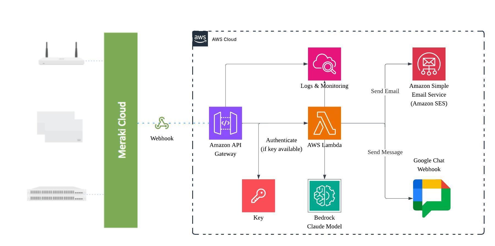

# Meraki Webhook Alert Processor

This project implements an AWS Lambda function that processes Cisco Meraki webhook alerts using Amazon Bedrock (Claude 4/3.5 Sonnet) for intelligent analysis and sends notifications via Google Chat and email.

## Architecture



The solution uses the following AWS services and flow:

1. **Meraki Dashboard** sends webhook alerts to API Gateway
2. **API Gateway** receives webhooks with optional API key authentication
3. **Lambda Function** processes alerts using Amazon Bedrock for AI analysis
4. **Amazon Bedrock** (Claude 4/3.5 Sonnet) provides intelligent alert analysis
5. **Notifications** sent via Google Chat webhooks and Amazon SES email
6. **CloudWatch** provides monitoring, logging, and alerting

## Features

- **Intelligent Analysis**: Uses Amazon Bedrock with Claude 4 and Claude 3.5 models for intelligent analysis
- **Cross-Region Inference**: Automatic support for Claude 4 models using cross-region inference profiles where required
- **Automatic Model Selection**: Automatically selects the best available Claude model (Claude 4 prioritized) for your AWS region
- **Model Fallback**: Gracefully falls back to alternative models if the primary model is unavailable
- **Multi-channel Notifications**: Sends formatted notifications to Google Chat and email
- **Error Handling**: Comprehensive error handling with fallback responses
- **Security**: Input sanitization and prompt injection protection
- **Monitoring**: CloudWatch alarms and detailed logging
- **CORS Support**: Properly configured for web-based integrations

## Prerequisites

1. **AWS Account** with appropriate permissions
2. **AWS CLI** configured with credentials
3. **Python 3.8+** installed
4. **Bedrock Access** to Claude 4 or Claude 3.5 models in your region
5. **SES Setup** (optional, for email notifications)
6. **Google Chat Webhook** (optional, for chat notifications)

## Quick Start

### 1. Clone and Setup

```bash
cd meraki-webhook-alert-processor
chmod +x deploy-advanced.sh
```

### 2. Configure AWS Bedrock

Check available models in your region:

```bash
./check-bedrock-models.sh us-east-1
```

**Optional**: Update CloudFormation template with current available models:

```bash
./update-model-mapping.sh
```

This script will:
- Check model availability across all AWS regions
- Select the best available models for each region  
- Update your CloudFormation template with actual model IDs
- Create a backup of your original template

Ensure you have access to Claude models:

```bash
# Check available models in your region
aws bedrock list-foundation-models --region us-east-1

# Request access to Claude models if needed
# Go to AWS Console → Bedrock → Model Access
```

### 3. Deploy the Stack

Run the advanced deployment script:

```bash
./deploy-advanced.sh
```

The script will:
- Validate prerequisites
- Prompt for configuration
- Create CloudFormation stack
- Deploy Lambda function
- Run basic tests
- Display webhook URL

### 4. Alternative: Simple Deployment

For a simpler deployment process, use the basic CloudFormation deployment commands shown in the Manual Deployment section below.

## Configuration

### Environment Variables

The Lambda function uses the following environment variables:

| Variable | Description | Required |
|----------|-------------|----------|
| `GOOGLE_CHAT_WEBHOOK_URL` | Google Chat webhook URL | No |
| `SES_SENDER_EMAIL` | Verified SES sender email | No |
| `SES_RECIPIENT_EMAILS` | Comma-separated recipient emails | No |
| `ENVIRONMENT` | Environment name (dev/staging/prod) | Yes |
| `BEDROCK_MODEL_ID` | Bedrock model ID to use | Yes (auto-selected) |

### CloudFormation Parameters

| Parameter | Description | Default |
|-----------|-------------|---------|
| `GoogleChatWebhookUrl` | Google Chat webhook URL | Empty |
| `SenderEmail` | SES verified sender email | Empty |
| `RecipientEmails` | Comma-separated recipients | Empty |
| `LambdaFunctionName` | Lambda function name | meraki-webhook-processor |
| `ApiGatewayName` | API Gateway name | meraki-webhook-api |
| `Environment` | Environment (dev/staging/prod) | dev |
| `BedrockModelId` | Specific model ID (empty for auto-selection) | Empty |

## Bedrock Model Selection

The template automatically selects the best available Claude model for your AWS region:

### Automatic Selection (Recommended)

Leave the `BedrockModelId` parameter empty, and the system will automatically choose:

1. **Primary**: Latest Claude 3.5 Sonnet with regional prefix
2. **Secondary**: Claude 3 Sonnet (fallback)
3. **Tertiary**: Claude Instant (final fallback)

### Manual Selection

Specify a model ID if you want to use a specific model:

```bash
# Check available models first
./check-bedrock-models.sh

# Deploy with specific model
aws cloudformation deploy \
  --parameter-overrides BedrockModelId="us.anthropic.claude-3-5-sonnet-20241022-v2:0" \
  ...
```

### Regional Model Availability

Different regions have different model availability:

- **US East/West**: `us.anthropic.claude-3-5-sonnet-20241022-v2:0`
- **Europe**: `eu.anthropic.claude-3-5-sonnet-20241022-v2:0`
- **Asia Pacific**: `apac.anthropic.claude-3-5-sonnet-20241022-v2:0` or `apac.anthropic.claude-sonnet-4-20250514-v1:0`
- **Canada**: `anthropic.claude-3-sonnet-20240229-v1:0`

### Fallback Behavior

If the primary model fails, the Lambda function will automatically try:
1. Claude 3 Sonnet
2. Claude Instant
3. Fallback analysis (no AI)

## Manual Deployment

If you prefer manual deployment:

### 1. Deploy CloudFormation Stack

```bash
aws cloudformation deploy \
  --template-file cloudformation-template.yaml \
  --stack-name meraki-webhook-processor-dev \
  --parameter-overrides \
    Environment=dev \
    GoogleChatWebhookUrl="YOUR_GOOGLE_CHAT_URL" \
    SenderEmail="your@email.com" \
    RecipientEmails="admin@company.com,ops@company.com" \
  --capabilities CAPABILITY_NAMED_IAM \
  --region us-east-1
```

### 2. Update Lambda Code

```bash
# Create deployment package
zip -r lambda-deployment.zip lambda.py

# Update function
aws lambda update-function-code \
  --function-name meraki-webhook-processor-dev \
  --zip-file fileb://lambda-deployment.zip \
  --region us-east-1
```

## Setting Up Notifications

### Google Chat Webhook

1. In Google Chat, go to the space where you want notifications
2. Click the space name → Manage webhooks
3. Create a new webhook and copy the URL
4. Use this URL in the `GOOGLE_CHAT_WEBHOOK_URL` parameter

📖 **Detailed Guide**: For step-by-step instructions on creating Google Chat webhooks, see the official Google documentation: [Create a webhook in Google Chat](https://developers.google.com/workspace/chat/quickstart/webhooks#create-webhook)

### Amazon SES Email

1. Verify your sender email address:
```bash
aws ses verify-email-identity \
  --email-address your@email.com \
  --region us-east-1
```

2. Check verification status:
```bash
aws ses get-identity-verification-attributes \
  --identities your@email.com \
  --region us-east-1
```

3. For production, move out of SES sandbox:
   - Go to AWS Console → SES → Account dashboard
   - Request production access

## Configuring Meraki Dashboard

1. Log into your Meraki Dashboard
2. Go to Network-wide → Alerts
3. Add a webhook receiver:
   - Name: AWS Lambda Processor
   - URL: `https://your-api-id.execute-api.region.amazonaws.com/dev/webhook`
   - Shared secret: (optional)
4. Configure which alerts to send to the webhook

## API Key Management

The deployment includes optional API key authentication for enhanced security. When enabled, all requests to the webhook must include a valid API key.

### Managing API Keys

Use the `manage-api-key.sh` script to manage your webhook API keys:

```bash
# Make the script executable (if not already)
chmod +x manage-api-key.sh

# Show API key status and information
./manage-api-key.sh status -s your-stack-name -r us-east-1

# Get the current API key value
./manage-api-key.sh get -s your-stack-name -r us-east-1

# Generate a new API key (invalidates the old one)
./manage-api-key.sh regenerate -s your-stack-name -r us-east-1

# Test the webhook with the API key
./manage-api-key.sh test -s your-stack-name -r us-east-1
```

### API Key Authentication

When API key authentication is enabled:

1. **Secure**: All requests must include the `x-api-key` header
2. **Regeneratable**: You can generate new keys anytime
3. **Trackable**: Usage is logged in CloudWatch

#### Using the API Key

```bash
# With API key authentication
curl -X POST "https://your-api-id.execute-api.region.amazonaws.com/dev/webhook" \
  -H "x-api-key: your-api-key-here" \
  -H "Content-Type: application/json" \
  -d '{"alertType": "test"}'
```

#### Getting Your API Key

```bash
# Method 1: Use the management script
./manage-api-key.sh get -s your-stack-name -r us-east-1

# Method 2: Direct AWS CLI command
aws apigateway get-api-key \
  --api-key $(aws cloudformation describe-stacks \
    --stack-name your-stack-name \
    --query "Stacks[0].Outputs[?OutputKey=='WebhookApiKeyId'].OutputValue" \
    --output text) \
  --include-value \
  --query "value" \
  --output text
```

#### Security Best Practices

- **Keep API keys secure**: Never commit them to version control
- **Rotate regularly**: Generate new keys periodically using the management script
- **Monitor usage**: Check CloudWatch logs for unauthorized access attempts
- **Use HTTPS**: Always use secure connections for webhook requests

## Utility Scripts

The project includes several utility scripts to help with deployment and management:

### `check-bedrock-models.sh`
Check which Claude models are available in your AWS region:

```bash
./check-bedrock-models.sh us-east-1
```

Features:
- Shows all available Claude models with capabilities
- Provides model recommendations based on performance
- Displays model names, input/output types
- Checks Bedrock service availability

### `update-model-mapping.sh`
Dynamically update CloudFormation template with actual available models:

```bash
./update-model-mapping.sh
```

Features:
- Scans all AWS regions for available models
- Selects optimal models based on capability hierarchy
- Updates CloudFormation template automatically
- Creates backup of original template
- Interactive confirmation before updating

### `manage-api-key.sh`
Comprehensive API key management:

```bash
# Show API key status
./manage-api-key.sh status -s stack-name -r region

# Get API key value
./manage-api-key.sh get -s stack-name -r region

# Generate new API key
./manage-api-key.sh regenerate -s stack-name -r region

# Test webhook with API key
./manage-api-key.sh test -s stack-name -r region
```

### `deploy-advanced.sh`
Advanced deployment with interactive configuration:

```bash
./deploy-advanced.sh
```

Features:
- Interactive configuration setup
- Dependency validation and installation
- API key integration
- Comprehensive deployment summary
- Error handling and rollback

## Testing

## Testing

### Test the Webhook Endpoint

```bash
# Get webhook URL from stack outputs
WEBHOOK_URL=$(aws cloudformation describe-stacks \
  --stack-name meraki-webhook-processor-dev \
  --query "Stacks[0].Outputs[?OutputKey=='WebhookApiUrl'].OutputValue" \
  --output text)

# Test without API key (if authentication is disabled)
curl -X POST "$WEBHOOK_URL" \
  -H "Content-Type: application/json" \
  -d '{
    "alertType": "sensor_change_detected",
    "organizationName": "Test Org",
    "networkName": "Test Network",
    "alertData": {
      "sensorType": "temperature",
      "value": 75.5
    }
  }'

# Test with API key (if authentication is enabled)
API_KEY=$(./manage-api-key.sh get -s meraki-webhook-processor-dev -r us-east-1 | grep "API Key Value:" | cut -d' ' -f4)
curl -X POST "$WEBHOOK_URL" \
  -H "x-api-key: $API_KEY" \
  -H "Content-Type: application/json" \
  -d '{
    "alertType": "sensor_change_detected",
    "organizationName": "Test Org",
    "networkName": "Test Network",
    "alertData": {
      "sensorType": "temperature",
      "value": 75.5
    }
  }'

# Or use the built-in test command
./manage-api-key.sh test -s meraki-webhook-processor-dev -r us-east-1
```

### Monitor Logs

```bash
# Follow CloudWatch logs
aws logs tail /aws/lambda/meraki-webhook-processor-dev \
  --follow \
  --region us-east-1
```

## Alert Analysis

The system analyzes alerts and provides:

- **Severity Classification**: CRITICAL, HIGH, MEDIUM, LOW, INFO
- **Category Classification**: Security, Connectivity, Performance, Configuration, Hardware, Informational
- **Impact Assessment**: Potential business impact
- **Recommendations**: Specific action items
- **Resolution Time Estimates**: Expected time to resolve

## Supported Alert Types

The system can process various Meraki alert types:

- `sensor_change_detected` - Environmental sensor alerts
- `appliance_connectivity_change` - Device connectivity changes
- `client_connectivity_change` - Client connection issues
- `settings_changed` - Configuration changes
- `firmware_upgrade_started` - Firmware update notifications
- `firmware_upgrade_completed` - Firmware completion notifications

## Troubleshooting

### Common Issues

1. **Bedrock Access Denied**
   ```
   Solution: Request access to Claude 3.5 Sonnet in AWS Console → Bedrock → Model Access
   ```

2. **SES Email Not Verified**
   ```bash
   aws ses verify-email-identity --email-address your@email.com --region us-east-1
   ```

3. **Lambda Timeout**
   ```
   Solution: Increase timeout in CloudFormation template (currently 300s)
   ```

4. **Package Too Large**
   ```
   Solution: Use Lambda layers for large dependencies or optimize package size
   ```

### Debugging Steps

1. Check CloudWatch logs:
   ```bash
   aws logs describe-log-groups --log-group-name-prefix "/aws/lambda/meraki"
   ```

2. Test Lambda function directly:
   ```bash
   aws lambda invoke \
     --function-name meraki-webhook-processor-dev \
     --payload '{"alertType":"test"}' \
     response.json
   ```

3. Check API Gateway logs:
   ```bash
   aws logs describe-log-groups --log-group-name-prefix "API-Gateway-Execution-Logs"
   ```

## Security Considerations

- Input sanitization prevents prompt injection attacks
- IAM roles follow least privilege principle
- API Gateway has throttling enabled
- CloudWatch alarms monitor for anomalies
- Sensitive data is not logged

## Cost Optimization

- Lambda reserved concurrency limits costs
- CloudWatch log retention set to 14 days
- API Gateway throttling prevents abuse
- Bedrock usage optimized with prompt engineering

## Monitoring and Alerting

The stack includes CloudWatch alarms for:

- Lambda function errors
- Lambda function duration
- API Gateway 4xx errors
- API Gateway 5xx errors

## Updating the Stack

To update the deployment:

```bash
# Method 1: Use deployment script
./deploy-advanced.sh

# Method 2: Manual update
aws cloudformation deploy \
  --template-file cloudformation-template.yaml \
  --stack-name meraki-webhook-processor-dev \
  --capabilities CAPABILITY_NAMED_IAM
```

## Cleanup

To remove all resources:

```bash
aws cloudformation delete-stack \
  --stack-name meraki-webhook-processor-dev \
  --region us-east-1
```

## Contributing

1. Fork the repository
2. Create a feature branch
3. Test your changes thoroughly
4. Submit a pull request with documentation updates

## License

This project is licensed under the MIT License. See the LICENSE file for details.

## Support

For issues and questions:
1. Check the troubleshooting section above
2. Review CloudWatch logs for error details
3. Submit an issue with detailed error information

## Cross-Region Inference Profiles

Claude 4 models (Sonnet 4 and Opus 4) require cross-region inference profiles for invocation in most AWS regions. This deployment automatically handles this:

### How It Works

1. **Automatic Detection**: The Lambda function detects when a model requires an inference profile
2. **Profile ARN Generation**: CloudFormation automatically generates the correct inference profile ARNs based on your region
3. **Fallback Support**: If inference profile invocation fails, the system falls back to direct model invocation
4. **Regional Optimization**: Uses region-appropriate inference profiles (US, EU, APAC)

### Environment Variables

The CloudFormation template automatically sets these environment variables:

```bash
BEDROCK_CLAUDE4_SONNET_PROFILE_ARN=arn:aws:bedrock:region::inference-profile/us.anthropic.claude-sonnet-4-20250514-v1:0
BEDROCK_CLAUDE4_OPUS_PROFILE_ARN=arn:aws:bedrock:region::inference-profile/us.anthropic.claude-opus-4-20250514-v1:0
```

### Testing Inference Profiles

The cross-region inference profile functionality is automatically handled by the Lambda function. You can verify it's working by checking the CloudWatch logs after deploying and testing your webhook endpoint.

### Supported Regions

Inference profiles are automatically mapped for:
- US regions: `us.anthropic.claude-*`
- EU regions: `eu.anthropic.claude-*`
- APAC regions: `apac.anthropic.claude-*`
- Canada: Uses US profiles

## Project Structure

```
lambda-amazon-q/
├── README.md                           # This documentation
├── meraki-webhook-notification-diagram.jpeg # Architecture diagram
├── cloudformation-template.yaml       # Infrastructure as Code
├── lambda.py                          # Main Lambda function code
├── requirements.txt                   # Python dependencies
├── deploy-advanced.sh                 # Comprehensive deployment script
├── check-bedrock-models.sh           # Model availability checker
├── manage-api-key.sh                 # API key management utility
├── update-model-mapping.sh           # Model mapping updater
└── redeploy-api.sh                   # API Gateway redeployment utility
```

### Core Files

- **`cloudformation-template.yaml`**: Complete AWS infrastructure definition with cross-region inference profile support
- **`lambda.py`**: Intelligent webhook processor with Bedrock integration and multi-channel notifications
- **`deploy-advanced.sh`**: Production-ready deployment with validation and testing
- **`check-bedrock-models.sh`**: Validates model availability across AWS regions
- **`manage-api-key.sh`**: Manages API Gateway keys for webhook authentication
